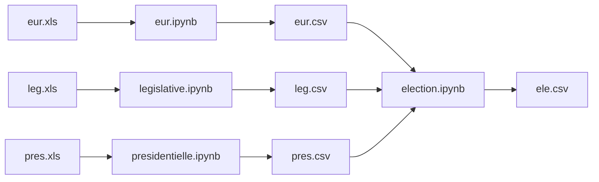

# Colonnes à garder

| Colonne          | Type    | Commentaire        |
|------------------|---------|--------------------|
| Code département | INT     | Code INSEE         |
| Votants          | FLOAT   | A convertir en INT |
| Extreme Gauche   | FLOAT   | ?                  |
| Gauche           | FLOAT   | ?                  |
| Droite           | FLOAT   | ?                   |
| Extreme Droite   | FLOAT   |  ?                  |
| Autre            | FLOAT   |    ?                |
| Election         | VARCHAR | Type d'éléection   |
| Annee            | INT     |                    |
